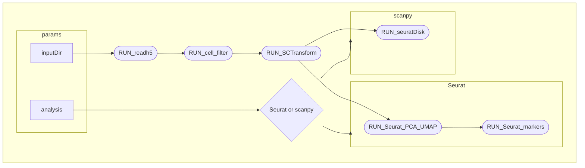

# nf-scRNA: Nextflow Pipeline for 10x scRNA-seq Processing (In Progress)

This repository hosts a **Nextflow** pipeline under active development for processing **10x Genomics single-cell RNA-seq** data.\
At this stage, the workflow includes two functional processes:

1.  **Reading and merging** multiple 10x Chromium output folders into a unified Seurat object.\
2.  **Filtering** low-quality cells based on customizable thresholds.

------------------------------------------------------------------------

## 🧩 Current Workflow Overview

```         
Code/ 
   └── nf-scRNA/ 
        ├── main.nf # Nextflow main workflow 
        ├── nextflow.config # Config parameters (paths, results) 
        ├── Docker_files/
        │   ├── Seurat_base/        # folder containing all documents for the sc_rna:v1.0 docker image
        │   │   ├── building.log         # complet log of the image building step
        │   │   ├── dockerfile           # source dockerfile
        │   │   ├── packages_list.csv    # complete list of the packages included in the image
        │   │   └── README.md            # documentation
        │   └── Seurat+celldex      # sc_rna:v1.1 expandiding v1.0 with seurat fix/v.5.3.1 celldex and
        │        └── dockerfile        SingleR
        │         
        ├── r-scripts/  
        │      ├── read_h5.R          # Read & merge 10x data  
        │      ├── cell_filter.R      # Filter the cell based on countings and mitocondrial RNAs
        │      ├── RDS_to_scanpy.R    # convert the seurat object to a scanpy object .h5ad
        │      ├── SCTransform.R      # Seurat normalization using negative binomila distribution
        │      ├── seurat_PCA_UMAP.R  # Implementation of PCA y UMAP. Opcional batch effect                           │      │                        annotation to be finalized.   
        │      └── seurat_markers.R   # calculate clusters and the 20 top makers per cluster. Host cell  
        ├── HIV scanpy/
        │       ├── seurat_to_scanpy.py # script to produce clusters and markers after seuratDisk
        │       └──results/           # contains some sample images
        │                                
        ├── README 
        └── results/ # visualizations and images
```

### Processes

| Process | Description | Output |
|-------------------|----------------------------------|-------------------|
| **RUN_readh5** | Reads multiple 10x directories (e.g. GSM folders) and merges them into one Seurat object | no images |
| **RUN_cell_filter** | Filters cells by quality metrics (features, counts, mitochondrial content) | `5 .png analytics immages` |
| **RUN_SCTransform** | Normalize the count | no images |
| **RUN_seuratDisk** | Convert Seurat object .rds in a scanpy object .h5ad | list of the genes |
| **RUN_Seurat_PCA_UMAP** | perform the PCA or optionally Harmony and then the UMAP. | 4 .png resume images |
| **RUN_Seurat_markers** | calculate cluster and markers associated. contain cell annotation | 1 .png and 1 .cvs |



------------------------------------------------------------------------

## ⚙️ Requirements

-   **Nextflow ≥ 23.10**
-   **R ≥ 4.3**
-   R packages:
    -   `Seurat`, `tidyverse`, `ggplot2`, `Matrix, presto,`

------------------------------------------------------------------------

### 📜 Status

🚧 Work in progress!!!

[**Current modules:**]{.underline}

✅ RUN_readh5 - reads and merges multiple 10x datasets

✅ RUN_cell_filter - apply QC-based cell filtering

✅ RUN_SCTransform - normalization and scaling using negative binomial

✅ RUN_seuratDisk - saves Seurat object in h5Seurat file than convert it to .h5ad to be transferred to a scanpy script

✅ RUN_Seurat_PCA_UMAP - perform the PCA, optional batch correction (harmony and UMAP dimensionality reduction.)

✅ RUN_Seurat_markers - calculate cluster and markers associated. It also host cell annotation (to be completed)

🔜 RUN_cluster, RUN_annotation etc. (coming soon)

## 🧪 Running the Pipeline

\`\`\`bash git clone / https://github.com/bontix-77/scRNAseq.git cd scRNAseq/Code/nf-scRNA nextflow run main.nf